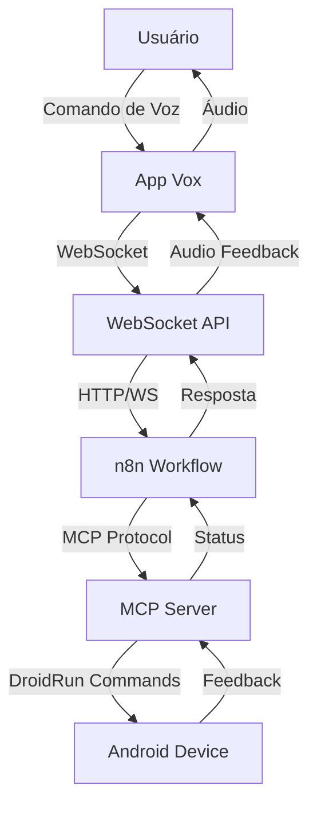

<div align="center">

# 🎤 Vox: Dando Voz àqueles que não têm

### Plataforma de Navegação Inteligente por Voz para Inclusão Digital Real


[Demonstração](#-demonstração) • [Recursos](#-recursos) • [Arquitetura](#-arquitetura) • [Instalação](#-instalação) • [Repositórios](#-repositórios-do-projeto)

</div>

---

## 📋 Índice

- [Sobre o Projeto](#-sobre-o-projeto)
- [A Inovação](#-a-inovação)
- [Público-Alvo](#-público-alvo)
- [Stack Tecnológica](#-stack-tecnológica)
- [Arquitetura](#-arquitetura)
- [Demonstração](#-demonstração)
- [Instalação](#-instalação)
- [Modelo de Negócio](#-modelo-de-negócio)
- [Repositórios do Projeto](#-repositórios-do-projeto)
- [Equipe](#-equipe)

---

## 🎯 Sobre o Projeto

**Vox** é uma solução inovadora desenvolvida para o HackathonUSP que transcende as limitações dos leitores de tela tradicionais. Trata-se de uma plataforma completa de navegação por voz que proporciona **inclusão digital real** através da automação inteligente de aplicativos Android.

Enquanto leitores de tela convencionais apenas narram o conteúdo da tela, o Vox permite que usuários **controlem completamente** o comportamento de seus dispositivos Android através de comandos de voz simples, potencializados por agentes de IA especializados.

### 🔑 Diferencial Principal

A tecnologia Vox integra um **superagente de IA** com a biblioteca open-source [DroidRun](https://github.com/droidrun/droidrun), possibilitando a automação completa de tarefas complexas em aplicativos móveis sem necessidade de interação manual com a interface.

---

## 💡 A Inovação

### Por que o Vox é Revolucionário?

O Vox não é apenas mais uma ferramenta de acessibilidade — é uma mudança de paradigma na forma como pessoas interagem com tecnologia móvel:

| **Solução Tradicional** | **Vox** |
|-------------------------|---------|
| Lê o que está na tela | **Executa ações complexas automaticamente** |
| Requer navegação manual | **Compreende intenções e age de forma autônoma** |
| Limitado à narração | **Controle total por voz** |
| Interface por interface | **Automação de fluxos completos** |

### 🚀 Caso de Uso: Agente Uber

Como **prova de conceito**, desenvolvemos um agente especializado em solicitar corridas no aplicativo Uber. A automação executa todo o fluxo:

```
Comando de Voz → "Vox, peça um Uber para o endereço X"
                 ↓
              Vox processa
                 ↓
         ┌───────────────────┐
         │  1. Abre o Uber   │
         │  2. Define destino│
         │  3. Seleciona     │
         │     pagamento     │
         │  4. Confirma      │
         │     corrida       │
         └───────────────────┘
                 ↓
           Tudo automatizado
```

Este é apenas o **começo**. A arquitetura permite a criação de agentes especializados para qualquer aplicativo.

---

## 👥 Público-Alvo

O Vox foi projetado com uma visão inclusiva abrangente, atendendo diversos grupos:

### 🎯 Usuários Primários

- **Pessoas com deficiência visual** (parcial ou total)
- **Pessoas com mobilidade reduzida** (dificuldade em interações físicas com dispositivos)
- **Analfabetos ou analfabetos funcionais**
- **Idosos e pessoas não letradas tecnologicamente**

### 🌟 Impacto Social

A acessibilidade tecnológica não deve ser um privilégio, mas um direito. O Vox democratiza o acesso à tecnologia móvel, permitindo que **qualquer pessoa**, independentemente de suas limitações físicas, cognitivas ou educacionais, possa utilizar aplicativos complexos com **autonomia e dignidade**.

---

## 🛠 Stack Tecnológica

O Vox utiliza uma arquitetura moderna e escalável, combinando tecnologias de ponta:

### Componentes Principais

```
┌─────────────────────────────────────────────────────────┐
│                    Aplicativo Vox                       │
│            (Entrada e conversão de áudio)               │
└────────────────────┬────────────────────────────────────┘
                     │
                     ↓ WebSocket
┌────────────────────────────────────────────────────────┐
│                   WebSocket API                         │
│        (Intermediação de comunicação)                   │
└────────────────────┬───────────────────────────────────┘
                     │
                     ↓
┌────────────────────────────────────────────────────────┐
│                       n8n                               │
│           (Orquestração de agentes)                     │
└────────────────────┬───────────────────────────────────┘
                     │
                     ↓
┌────────────────────────────────────────────────────────┐
│                  MCP Server + DroidRun                  │
│         (Execução de comandos no Android)               │
└─────────────────────────────────────────────────────────┘
```

### Tecnologias

| Componente | Tecnologia | Função |
|------------|-----------|---------|
| **n8n** | Plataforma de automação | Orquestração dos superagentes de IA |
| **MCP Server** | Model Context Protocol | Integração com DroidRun para controle Android |
| **DroidRun** | Biblioteca open-source | Execução de comandos na plataforma Android |
| **WebSocket API** | Protocolo de comunicação | Intermediação em tempo real entre n8n e Vox |
| **Aplicativo Vox** | Android Native | Interface de entrada de voz e conversão |
| **Docker Compose** | Containerização | Orquestração de toda a infraestrutura |

---

## 🏗 Arquitetura

### Visão Geral

A arquitetura do Vox foi projetada para ser **modular**, **escalável** e **extensível**:



### Fluxo de Execução

1. **Captura de Voz**: O usuário emite um comando de voz no aplicativo Vox
2. **Conversão**: O áudio é convertido em texto e enviado via WebSocket
3. **Orquestração**: O n8n recebe a instrução e aciona o agente apropriado
4. **Processamento IA**: O agente de IA interpreta a intenção e gera comandos
5. **Execução**: O MCP Server traduz para comandos DroidRun
6. **Automação**: DroidRun executa as ações no dispositivo Android
7. **Feedback**: O resultado é retornado ao usuário via áudio

### Estrutura do Repositório

```
n8n_whatsapp/
├── app/
│   ├── main.py                 # Aplicação principal
│   ├── mcp_servers/           
│   │   └── droidrun.py        # MCP Server para DroidRun
│   └── models/
│       └── base/
│           ├── abstract_agent.py    # Classe base para agentes
│           ├── llm_provider.py      # Provedor de LLM
│           └── prompt_provider.py   # Gerenciador de prompts
├── prompts/
│   └── uber_ride_creator.md   # Prompt do agente Uber
├── workflows/
│   └── Whatsapp Agent.json    # Workflow n8n
├── docker-compose.yml         # Orquestração de containers
├── Dockerfile                 # Imagem Docker
└── requirements.txt           # Dependências Python
```

---

## 🎬 Demonstração

### Agente Uber - Prova de Conceito

O agente Uber demonstra o poder da plataforma Vox:

**Cenário**: Usuário precisa solicitar uma corrida

**Comando de Voz**: *"Vox, preciso ir para a Avenida Paulista, 1500"*

**Ações Automatizadas**:
1. ✅ Abre o aplicativo Uber
2. ✅ Insere o endereço de destino
3. ✅ Seleciona a forma de pagamento preferencial
4. ✅ Confirma a solicitação da corrida
5. ✅ Informa ao usuário que a corrida foi solicitada

**Resultado**: Tarefa que levaria vários minutos e múltiplas interações é executada em **segundos** com **zero interação manual**.

---

## 🚀 Instalação

### Pré-requisitos

- Docker e Docker Compose instalados
- Dispositivo Android com DroidRun configurado
- Acesso aos repositórios do projeto

### Passo a Passo

1. **Clone este repositório**:
```bash
git clone https://github.com/Educg550/n8n_whatsapp.git
cd n8n_whatsapp
```

2. **Configure as variáveis de ambiente**:
```bash
cp .env.example .env
# Edite o arquivo .env com suas configurações
```

3. **Inicie os containers**:
```bash
docker-compose up -d
```

4. **Acesse o n8n**:
- URL: `http://localhost:5678`
- Importe o workflow em `workflows/Whatsapp Agent.json`

5. **Configure o MCP Server**:
- O servidor MCP será iniciado automaticamente
- Verifique os logs: `docker-compose logs -f`

6. **Conecte o aplicativo Vox**:
- Configure a URL do WebSocket API
- Teste a conexão de voz

### Desenvolvimento

Para desenvolvimento local:

```bash
# Instale as dependências
pip install -r requirements.txt

# Execute a aplicação
python app/main.py
```

---

## 💼 Modelo de Negócio

### B2B2C: Acessibilidade como Serviço

O modelo de negócio do Vox é baseado em **parcerias com empresas** que desejam tornar seus aplicativos verdadeiramente acessíveis:

#### 🎯 Proposta de Valor

**Para Empresas (B2B)**:
- ✅ Conformidade com legislações de acessibilidade
- ✅ Expansão de base de usuários
- ✅ Diferenciação competitiva
- ✅ Responsabilidade social corporativa
- ✅ Solução white-label personalizável

**Para Usuários Finais (B2C)**:
- ✅ Acesso gratuito ou subsidiado
- ✅ Experiência superior aos leitores de tela
- ✅ Autonomia e independência
- ✅ Suporte a múltiplos aplicativos

#### 💰 Modelo de Receita

1. **Licenciamento**: Taxa recorrente por aplicativo integrado
2. **Customização**: Desenvolvimento de agentes especializados
3. **SaaS**: Hospedagem e manutenção da infraestrutura
4. **Analytics**: Insights sobre uso e acessibilidade

#### 🌍 Potencial de Mercado

- **1 bilhão+** pessoas com deficiência visual no mundo
- Mercado global de tecnologia assistiva: **US$ 26 bilhões** (2024)
- Crescimento anual projetado: **7.8%** até 2030

### Cases de Aplicação

| Setor | Aplicação | Impacto |
|-------|-----------|---------|
| **Transporte** | Uber, 99, etc | Mobilidade urbana independente |
| **E-commerce** | Lojas online | Compras autônomas |
| **Bancos** | Apps bancários | Inclusão financeira |
| **Saúde** | Telemedicina | Acesso a serviços médicos |
| **Educação** | Apps educacionais | Democratização do ensino |

---

## 📚 Repositórios do Projeto

O projeto Vox é composto por três repositórios principais:

| Repositório | Descrição | Link |
|-------------|-----------|------|
| **Vox** | Aplicativo Android para entrada e conversão de voz | [lfelipediniz/Vox](https://github.com/lfelipediniz/Vox) |
| **WebSocketAPI** | API de intermediação em tempo real | [lfelipediniz/WebSocketAPI](https://github.com/lfelipediniz/WebSocketAPI) |
| **n8n + MCP** | Orquestração e integração DroidRun | [Educg550/n8n-mcp-orchestrator](https://github.com/Educg550/n8n-mcp-orchestrator) |

---

## 👨‍💻 Equipe

Projeto desenvolvido para o **HackathonUSP 2025** por uma equipe comprometida com a inclusão digital e acessibilidade tecnológica.

---

## 📄 Licença

Este projeto está sob **Licença Proprietária**. Todos os direitos reservados.

- ❌ **Uso comercial proibido** sem licença específica
- ❌ **Distribuição e modificação não autorizadas**
- ✅ **Visualização e estudo para fins educacionais**
- ✅ **Contribuições mediante aprovação dos mantenedores**

Para **uso comercial** ou **licenciamento empresarial**, entre em contato com os desenvolvedores.

---

<div align="center">

### 🌟 Vox: Tecnologia que liberta, voz que inclui

**Desenvolvido com ❤️ para o HackathonUSP 2025**

</div>
